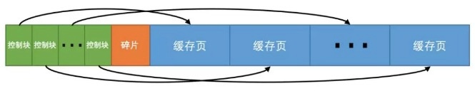
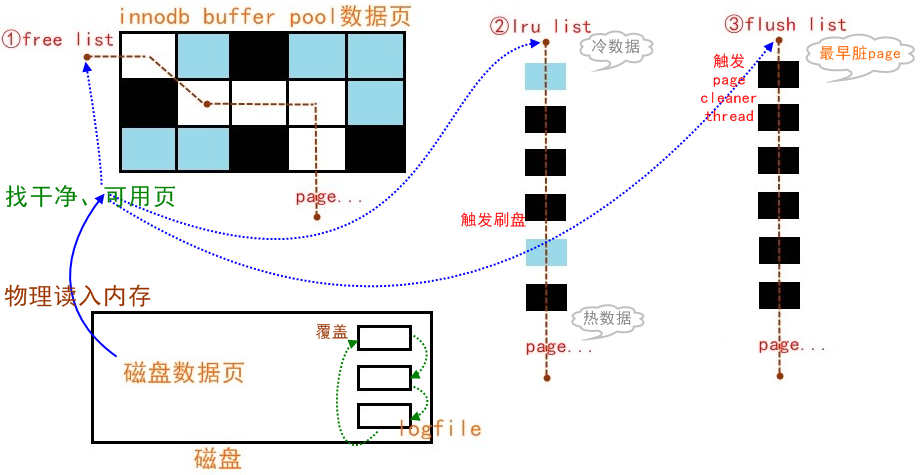

# buffer pool

## 简介

   innodb是基于磁盘存储的，并将其记录按照页的方式进行管理。在数据库系统中由于CPU速度与磁盘速度之间的鸿沟，基于磁盘的数据库系统通常使用缓冲技术来提高数据的整体性能。在innodb中，采用buffer pool来进行缓存，其主要用于缓存表和索引的数据，通过在内存中操作数据，从而加快处理速度。

## buffer pool结构

从官方文档给的图中，可以看到buffer pool结构的一个概览，整个buffer pool分成一块块的，其中还标明了change buffer，自适应哈希，实际这里的一块对应的就是数据在硬盘存储的一页，所以buffer pool也是以页为单位进行缓存的管理的。但是官方文档给的这个图是个innodb整体结构的概览图，还看不出buffer pool的结构。

[INNODB存储引擎之缓冲池](https://www.cnblogs.com/wxzhe/p/9912548.html)

在buffer pool中，innodb为每个缓存页都创建了控制信息，这些控制信息包括了space id、page no、页在buffer pool的地址以及一些锁信息和lsn信息等，这些信息可以称为缓存页的控制块，已缓存页是一对一的。而buffer pool是一块连续的内存区域，所以看起来是下面这个样子：

## 缓存管理算法

buffer pool以页为单位进行存储的，可大致分为三种类型：
1.  free page：从未用过的页
2.  clean page：干净的页，数据页的数据和磁盘一致
3.  dirty page：脏页

而在buffer pool中通过三种链将这三种页串联起来：
1.  free list：将free数据页使用链表链起来。
2.  lru list：根据冷热将clean、dirty链起来，采用lru变种算法管理。
3.  flush list：将页按照最早脏时间（设置脏页标记的时间）链起来。

其中，这三种链采用不用的算法进行管理。

### free list

数据库刚启动的时候，lru列表为空，此时需要用到的时候直接将free列表中的页删除，在lru列表中增加相应的页，维持页数守恒。

### lru list

以下为官方文档标注的算法
1.  3/8的list信息是作为old list，这些信息是被驱逐的对象。**3/8是默认值，其中可以通过innodb_old_blocks_pct这个参数来控制冷热区的分界点**。
2.  list的中点就是我们所谓的old list头部和new list尾部的连接点，相当于一个界限。
3.  如果是old list的数据被访问到了，这个页信息就会变成new list，变成young page，就会将数据页信息移动到new sublist的头部。如果因为需要而读取页面，则会立即进行第一次访问，并使页面变得年轻。如果由于预读而读取了页面，则第一次访问不会立即发生（并且在页面被逐出之前可能根本不会发生）**（这句话是什么意思呢？这里提到的两种情况，都是通过InnoDB提供一个参数来实现：innodb_old_blocks_time。这个参数主要是控制新数据成为热数据所需要的时间，默认是1s，就是说如果该新数据在1s内没有被刷走，就会调入热区）**。

默认情况下，查询读取的页面会立即移动到new sublist中，这意味着它们会更长时间地保留在buffer pool中。表扫描（例如为mysqldump操作执行，或者SELECT带有no WHERE子句的语句）可以将大量数据带入buffer pool并逐出相同数量的旧数据，即使新数据从未再次使用过。**这里实际讲的就是为什么buffer pool采用lru的变种算法来进行缓存的管理，这其实是一种算法的优化**

### flush list

flush list 里面全都是脏页，其最主要的作用是在脏页刷盘的时候，可快速遍历所有脏页。

## 预读

预读是innodb在I/O操作上的一个优化，它会判断一些页面会很快就需要用到，则会异步地去加载这些页面。那么这里有两个问题，一个是，它是如何判断的这些页面需要的，第二个是，一些页面指的是哪些页面。在Innodb中提供以下两种方式进行预读：

1.  线性预读：当一个extent内的page被顺序读取的数量超过一个阈值（通过**innodb_read_ahead_threshold**设置）则会将该extent相邻的下一个extent的所有page都给加载到缓存中。
2.  随机预读：当发现同一个extent的page未全部加载到缓存中，则会将剩余的page进行加载（可通过**innodb_random_read_ahead**进行开关控制，但是其存在性能不稳定的缺点，在5.5以后的版本默认为关闭）。

## 自适应哈希

Innodb存储引擎会监控对表上二级索引的查找，如果发现某二级索引被频繁访问，二级索引成为热数据，建立哈希索引可以带来速度的提升。其优点有：1. 访问速度快，O（1）的时间复杂度 缺点： 1. 占用buffer pool空间 2. 只有等值查询才会使用到自适应哈希缩影 3. 其使用场景非常有限，在数据量少（数据量大则会导致冲突频繁，失去哈希的意义）且稳定（不频繁修改，自适应哈希索引的修改为互斥性）的情况使用自适应哈希索引才有意义。

## 锁信息

## 数字字典

## change buffer

[change buffer](http://mysql.taobao.org/monthly/2015/07/01/)

### 为什么需要change buffer

在对数据进行dml操作时，通常会伴随着二级索引的更改，如果二级索引页在缓存中，直接更改缓存没毛病，但是如果不在，则需要到硬盘上加载，这时候就会产生一个随机I/O（为什么是随机IO呢？一般对单条数据操作都可以认为是随机IO），降低了性能，而innodb进行了优化，先将这些对二级索引的更改缓存在change buffer里，然后择机进行二级索引的读取并进行合并，当合并操作触发时，其是在累积了一定量的索引更改的基础上进行的，从而把单个的随机io转化成批量的顺序io，提高了性能。

