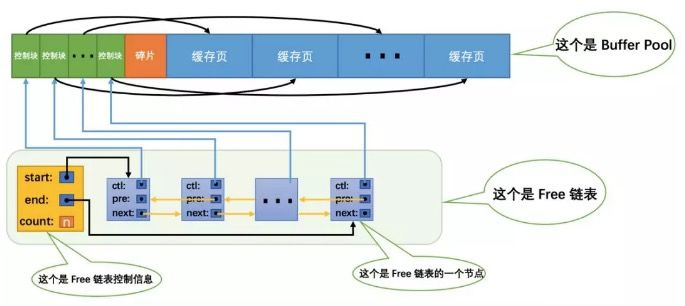

# buffer pool

## 简介

innodb是磁盘存储引擎，数据都存储在磁盘上，但是硬盘实际上只做数据的储存，若想对数据进行操作，那么则需要把数据加载到内存上，同时通过内存来缓存数据，从而加快处理速度。

## 数据结构

buffer pool是innodb的缓存池，而在缓存上有多种算法，有LRU，LFU
，FIFO等，而buffer pool实际就是采用LRU算法来实现的，而在LRU的实现上，通常采用链表的方式来管理缓存数据，buffer pool也是如此。

### LRU

在innodb中，数据以页为单位来进行存储，写入和读取也是以页为单位，所以buffer pool管理的也是页，把页加入控制信息封装成节点，其中控制信息就包括这些控制信息包括该页所属的表空间编号（space id）、页号(page number)、页在Buffer Pool中的地址，一些锁信息以及LSN信息。buffer pool在内存里一块连续的区域，那整体看来是这样子的：

从图中可以看出，我们为了管理好这个链表，特意为这个链表定义了一个控制信息，里边儿包含着链表的头节点地址，尾节点地址，以及当前链表中节点的数量等信息。我们在每个链表的节点中都记录了某个缓存页控制块的地址，而每个缓存页控制块都记录着对应的缓存页地址，所以相当于每个链表节点都对应一个空闲的缓存页。

#### free list

上面的图中标的是free list而不是lru list，那这个到底是什么呢？它的一个作用是，通过它来管理buffer pool的空闲缓存页。在MySQL最初启动的时候，就把buffer pool划分成一块块缓存页的，放到free list中进行管理。当新数据需要缓存时，首先会从free list进行申请的，若有，则把分配到的缓存页封装成lru节点插入到lru list中，free list再把这个空闲节点删掉即可；而当free list为空时，才会在lru进行淘汰老数据页获取缓存页。

#### lru list

buffer pool的大小是有限的，所以free list的节点数量也是有限的，当free list都用完之后该怎么办呢？那就得淘汰掉已缓存的页，已缓存的页就保存在lru list里面，通过变种的lru算法来进行缓存管理，什么是变种的lru算法呢？先从的普通lru算法来看，当我们去访问缓存页的时候会有以下两种情况：

1.  缓存页不在buffer pool里，则需要从硬盘上加载缓存页并封装成节点，然后插入lru链表的头部
2.  缓存页在buffer pool里，则把对应的节点移到链表的头部。

这种普通的算法在全表扫描的情况下会出现问题，会把所有缓存都冲掉，造成缓存数据的读取得重新进行从硬盘上加载，降低了缓存命中率，一般来说全表扫描的频率不会太高，但是一次全表扫描就会把缓存数据都冲掉了，如果缓存好不容易加载进行了，结果再来一次全表扫描，那缓存数据就又废掉了，缓存池效率就大大降低了。所以innodb在lru进行了优化，把链表分为成两个子列表，默认5/8为new sbulist，可以认为是热区，剩下的3/8为old sublist，可以认为是冷区，如下图所示：

其优化的算法修改如下：

1. 当缓存页不在buffer pool时，从硬盘上加载的数据封装成节点，插入old sublist里
2.  缓存页在buffer pool里，若缓存页在冷区，计算其存活时间是否超过阈值（默认是1s），若超过则将其移到new sublist头部。

在优化的算法中，存活时间是怎么计算的呢？通过在控制信息里记录第一次加载进buffer pool和当前访问的时间来计算的，而阈值是通过**innodb_old_blocks_time**来设置，单位是毫秒，设置得越大，则新数据越容易被淘汰。采用这种算法，使得新加载的数据会缓存在冷区，全表扫描事冲刷的也是冷区，而热区数据则不会被影响到。
在实际实现中，lru list 不是一开始就分为冷热区的，当链表长度小于512时，其还是单链表，按照普通的lru算法来进行管理；当超过512时，才会分为冷热区，通过**innodb_old_blocks_pct**参数来控制冷热区的长度。在new sublist中还有一个优化点，那就是，如果缓存命中热区的前1/4，则不会发生节点移到的，因为热区的数据频繁移动没有意义，反而增大了开销，热点数据始终不会被刷出，所以可以把热区的前1/4称为超热区。

#### flu list

数据的修改也是也是在缓存页中进行的，但并不是每次修改都会把会修改后的页同步到磁盘上，这样一次修改就会产生一次物理写操作，性能可想而知，而innnodb是把缓存页的标记为dirty page，也就是脏页，再放入到flu list里面，然后在特定的时机，批量进行脏页的刷盘，降低了物理写的次数，从而提高了性能。

### 缓存页的查找

当需要查找缓存页的时候，需要到lru list来进行查找，但并不是通过遍历链表的线性方式来查找，当链表足够长的时候，这种查找性能就会变得低下，而innodb呢，是通过hash page链的方式来加快查询性能，通过以space id加page no作为key，查找到对应的缓存页

### buffer pool instance

在innodb中，buffer pool是不止一个的，会存在多个实例，每个实例都是一个完整的buffer pool，都有自己的free list、lru list和flu list等数据结构，而不同的实例存储不同的内容。分成多个实例的一个作用就是能够很好地减少高并发时候缓存池的争用

### 数据预读

如果一个数据页被读入Buffer Pool，其周围的数据页也有很大的概率被读入内存，与其分开多次读取，还不如一次都读入内存，从而减少磁盘寻道时间。在官方的InnoDB中，预读分两种，随机预读和线性预读：

1. 随机预读。这种预读发生在一个数据页成功读入Buffer Pool的时候。在一个Extent范围(1M，如果数据页大小为16KB，则为连续的64个数据页)内，如果超热点数据页（new sublist前1/4的数据）大于一定数量（默认是13个数据页），就把整个Extend的其他所有数据页(依据page_no从低到高遍历读入)读入Buffer Pool。

2.  这中预读只发生在一个边界的数据页(Extend中第一个数据页或者最后一个数据页)上。在一个Extend范围内，如果大于一定数量(通过参数**innodb_read_ahead_threshold**控制，默认为56)的数据页是被顺序访问(通过判断数据页access time是否为升序或者逆序来确定)的，则把下一个Extend的所有数据页都读入Buffer Pool。

## 存储内容

buffer pool中缓存的数据页类型有: 索引页、数据页、undo页、插入缓冲（insert buffer)、自适应哈希索引（adaptive hash index)、InnoDB存储的锁信息（lock info)、数据字典信息（data dictionary)等。

### 数字字典信息

数据字典包括包含用于跟踪对象，如表，索引，和表中的列的元数据的内部系统表。这里有很重要的一点是，索引的数据也存储在数字字典中，当一条select语句被解析出需要走表的索引的时候，那需要到哪里获取索引的根节点呢？就是通过数字字典来进行查询，可以找到索引对应的space id及page no。

### 自适应哈希索引

Innodb存储引擎会监控对表上二级索引的查找，如果发现某二级索引被频繁访问，innodb就会使用索引键的前缀建立一个哈希索引。将索引值转换为一种指针，便于直接访问，带来速度的提升。

特点：  
1.  哈希索引，查询消耗 O(1)
2.  降低对二级索引树的频繁访问资源。
3.  自适应

缺点：
1.  hash自适应索引会占用innodb buffer pool；
2.  自适应hash索引只适合搜索等值的查询，如select * from table where index_col='xxx'，而对于其他查找类型，如范围查找，是不能使用的；

### change buffer

在对数据进行dml操作时，通常会伴随着二级索引的更改，如果二级索引页在缓存中，直接更改缓存没毛病，但是如果不在，则需要到硬盘上加载，这时候就会产生一个随机I/O（为什么是随机IO呢？一般对单条数据操作都可以认为是随机IO），降低了性能，而innodb进行了优化，先将这些对二级索引的更改缓存在change buffer里，然后择机进行二级索引的读取并进行合并，当合并操作触发时，其是在累积了一定量的索引更改的基础上进行的，从而把单个的随机io转化成批量的顺序io，从而提高了性能。

#### 缓存条件

1.  用户设置了选项innodb_change_buffering；
2.  只有叶子节点才会去考虑是否使用change buffer（当涉及非叶子节点时，即是在页分裂和页合并的情况下，此时必须将索引树全部读取，才能执行页分裂和页合并，所以非叶子节点不会使用change buffer）；
3.  对于聚集索引，不可以缓存操作(很容易想到，聚集一般是常驻内存的，change buffer的使用前提是数据页未加载至buffer pool)；
4.  对于唯一二级索引(unique key)，由于索引记录具有唯一性，因此无法缓存插入操作（唯一索引在插入和修改时，必须去检查唯一性，所以得去加载整颗树，change buffer便失去了作用），但可以缓存删除操作；
5.  表上没有flush 操作，例如执行flush table for export时，不允许对表进行缓存（防止刷盘时，对缓存数据修改，导致数据混乱）

#### 合并时机

1.  用户线程选择二级索引进行数据查询时
2.  当尝试缓存插入操作时，如果预估page的空间不足（预估的方法为记录每个页的大概的储存增长情况），可能导致索引页分裂，则定位到尝试缓存的page no在ibuf btree中的位置，最多merge 8 个page，合并以完成页分裂，**为什么是8个呢**？
3.  后台线程发起，当实例处于空闲状态（IDLE），合并全部的页；当实例处于活跃状态（ACTIVE），按照当前总数来计算，合并一定数量的页；当执行slow shutdown则必须合并所有的页；

## 数据页的访问流程

1. 当select语句解析所要执行的索引时（命中索引的情况），从数据字典中获取到索引根页的space id和page no，转2。
2. 根据space id和page no确定该页缓存在哪一个buffer pool instance，转3。
3. 根据space id和page no来判断页是否缓存在buffer pool中，若缓存命中，转8；否则，转4；
4. 从磁盘上加载该页，向free list申请空闲页，若有，转5；否则淘汰lru list最后一个节点（若是脏页则进行单页刷盘）。转8.
5.  从free list删除空闲块，装载新数据页。当lru list的长度小于512时，则插入lru list的尾部；否则等于大于512时，插入lru list冷区的头部。转6。
8. 若该缓存页处于new sublist后3/4，把该缓存页插入new sublist的头部；若缓存页处于old sublist，计算其存活时间，若大于阈值，把该缓存页插入new sublist的头部。最后，读取该缓存页，结束。

## 性能调优

## 相关资料

1.  [MySQL · 引擎特性 · InnoDB Buffer Pool](http://mysql.taobao.org/monthly/2017/05/01/)
2.  [INNODB存储引擎之缓冲池](https://www.cnblogs.com/wxzhe/p/9912548.html)
3.  [[玩转MySQL之十]InnoDB Buffer Pool详解](https://zhuanlan.zhihu.com/p/65811829)

