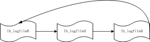

# redo log

## 概念

redo log 是用来保证事务的持久化，其为物理日志，即记录了对磁盘的什么地方做了什么修改，从而在恢复的时候可重新执行redo log，便可恢复到奔溃前的数据状态。

## redo log的作用

由于采用WAL的策略，每次事务提交时需要持久化 redo log 才能保证事务不丢。而延迟刷脏页则起到了合并多次修改的效果，避免频繁写数据文件造成的性能问题

## LSN （log sequence number）

日志序列号，它是一个不断递增的 unsigned long long 类型整数，它既用于表示修改脏页时的日志序号（可以理解页的版本号），也用于记录checkpoint（这里可知最近磁盘最新的版本是多少），通过LSN，可以具体的定位到其在redo log文件中的位置。

初始值： 8192
LSN=写入的日志字节 + block_header_size + block_tailer_size

例如当前重做日志的LSN = 2048,这时候innodb调用log_write_low写入一个长度为700的日志，2048刚好是4个block长度，那么需要存储700长度的日志，需要量个BLOCK(单个block只能存496个字节)。那么很容易得出新的LSN = 2048 + 700 + 2 * LOG_BLOCK_HDR_SIZE(12) + LOG_BLOCK_TRL_SIZE(4) = 2776。

## redo log file group

Redo log 以顺序的方式写入文件文件，写满时则回溯到第一个文件，进行覆盖写。（但在做redo checkpoint时，也会更新第一个日志文件的头部checkpoint标记，所以严格来讲也不算顺序写）

## redo log file

在每个组的第一个redo log file中，前2KB记录4个特定的部分，从2KB之后才开始记录log block。

## redo log buffer

## log block

redo log以块为单位进行存储的，每个块占512字节，这称为redo log block。每个redo log block由3部分组成：日志块头、日志块尾和日志主体。其中日志块头占用12字节，日志块尾占用8字节，所以每个redo log block的日志主体部分只有512-12-8=492字节。因为redo log记录的是数据页的变化，当一个数据页产生的变化需要使用超过492字节()的redo log来记录，那么就会使用多个redo log block来记录该数据页的变化。

### 日志块头

日志块头包含4部分：
1.  log_block_hdr_no：(4字节)该日志块在redo log buffer中的位置ID。
2.  log_block_hdr_data_len：(2字节)该log block中已记录的log大小。写满该log block时为0x200，表示512字节。
3.  log_block_first_rec_group：(2字节)该log block中第一个log的开始偏移位置。
4.  lock_block_checkpoint_no：(4字节)写入检查点信息的位置。

### 日志主体

其中log block中492字节的部分是log body，该log body的格式分为4部分：
1.  redo_log_type：占用1个字节，表示redo log的日志类型。
2.  space：表示表空间的ID，采用压缩的方式后，占用的空间可能小于4字节。
3.  page_no：表示页的偏移量，同样是压缩过的。
4.  Ÿredo_log_body表示每个重做日志的数据部分，恢复时会调用相应的函数进行解析。例如insert语句和delete语句写入redo log的内容是不一样的。

### 日志刷盘的规则

1.  发出commit动作时。已经说明过，commit发出后是否刷日志由变量 innodb_flush_log_at_trx_commit 控制。
2.  每秒刷一次。这个刷日志的频率由变量 innodb_flush_log_at_timeout 值决定，默认是1秒。要注意，这个刷日志频率和commit动作无关。
3.  当log buffer中已经使用的内存超过一半时。
4.  当有checkpoint时，checkpoint在一定程度上代表了刷到磁盘时日志所处的LSN位置。

### LSN记录流程

## Mini transaction

最小事务单元，是InnoDB对物理数据文件操作的最小事务单元，用于管理对Page加锁、修改、释放、以及日志提交到公共buffer等工作。一个mtr操作必须是原子的，一个事务可以包含多个mtr。每个mtr完成后需要将本地产生的日志拷贝到公共缓冲区，将修改的脏页放到flush list上。

## 疑问

1.  LSN存在哪里？
2.  LSN什么时候会递增？
3.  mtr如何做到原子操作的？
4.  redo log详细格式？
5.  做redo checkpoint时，redo log block里记录的checkpoint no是什么？

## 相关文章

1.  [详细分析MySQL事务日志(redo log和undo log)](https://www.cnblogs.com/f-ck-need-u/p/9010872.html)
2.  [innodb源码分析之重做日志结构](https://www.kancloud.cn/digest/innodb-zerok/195092)
